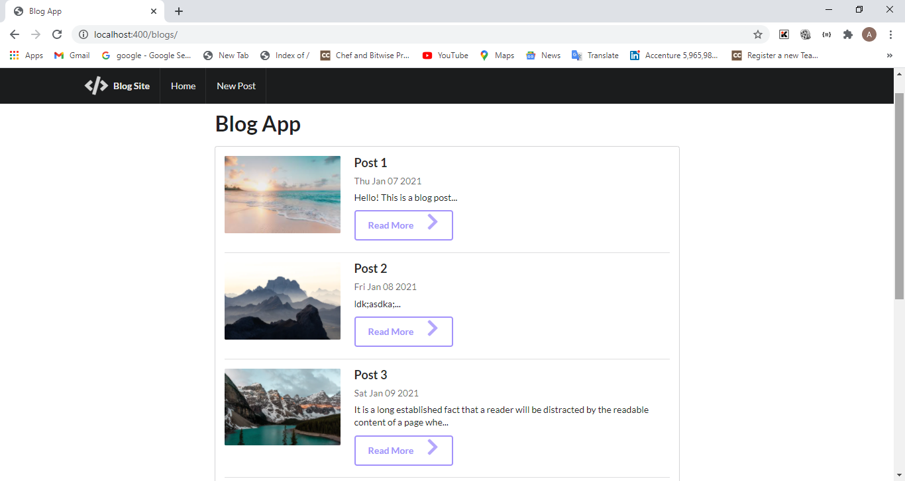
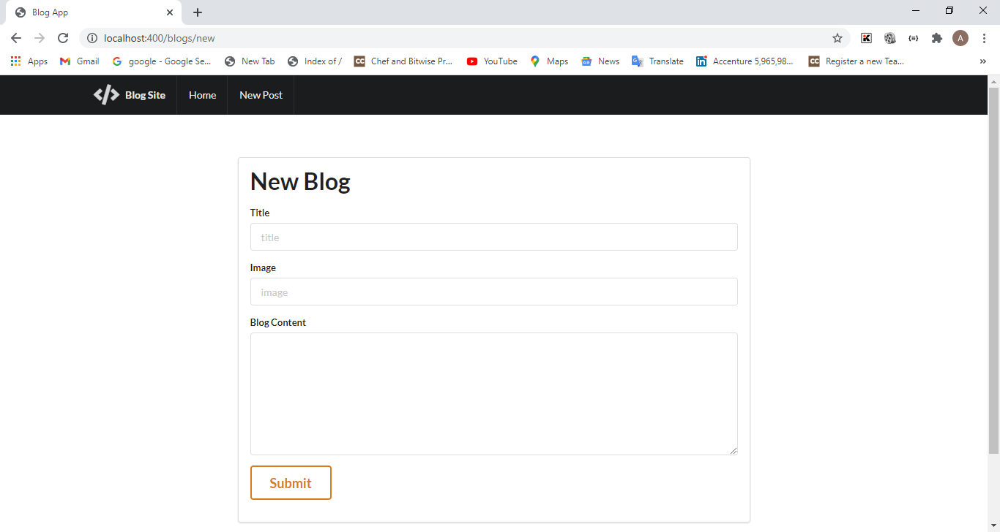
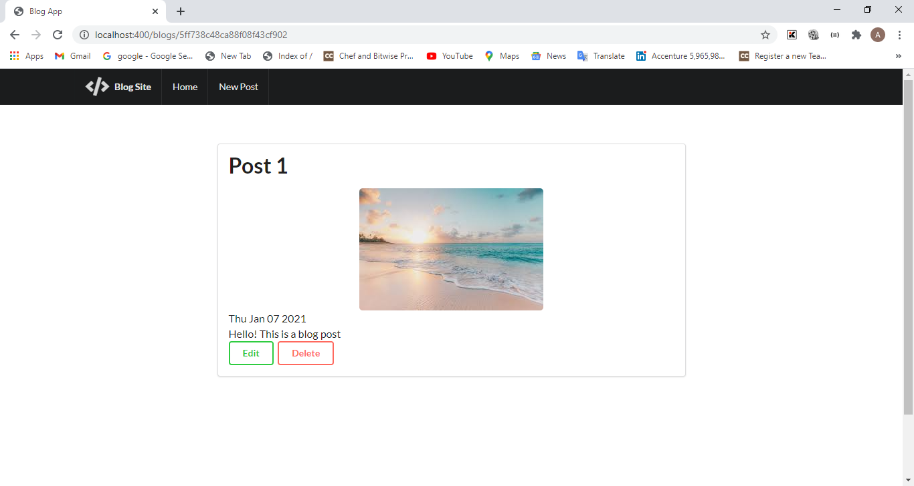
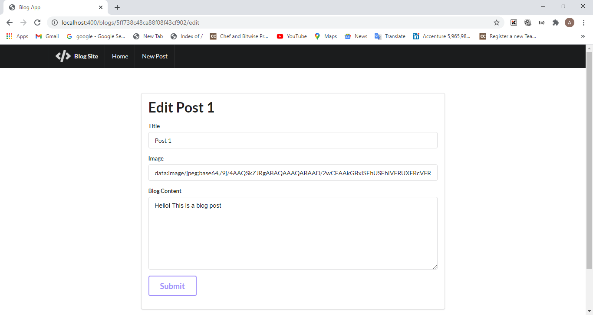

## Key features:
1. People can post thier blogs here.
2. They can edit them, delete them.
3. They can also see other's blogs.

## Technologies used:
1. `HTML5`, `CSS3`, `Semantic UI`
2. `Javascript`, `NodeJS`, `ExpressJS`, `MongoDB`

## How to set up project

1. run `npm init`
2. run `npm install express mongoose body-parser --save`
3. run `npm install ejs --save`

### Localhost:-

1. run `node app.js`
2. open `localhost:400/` to view it in browser.

## Screenshots:-

### Home Page

### Add Blog

### Read More

### Edit Blog

